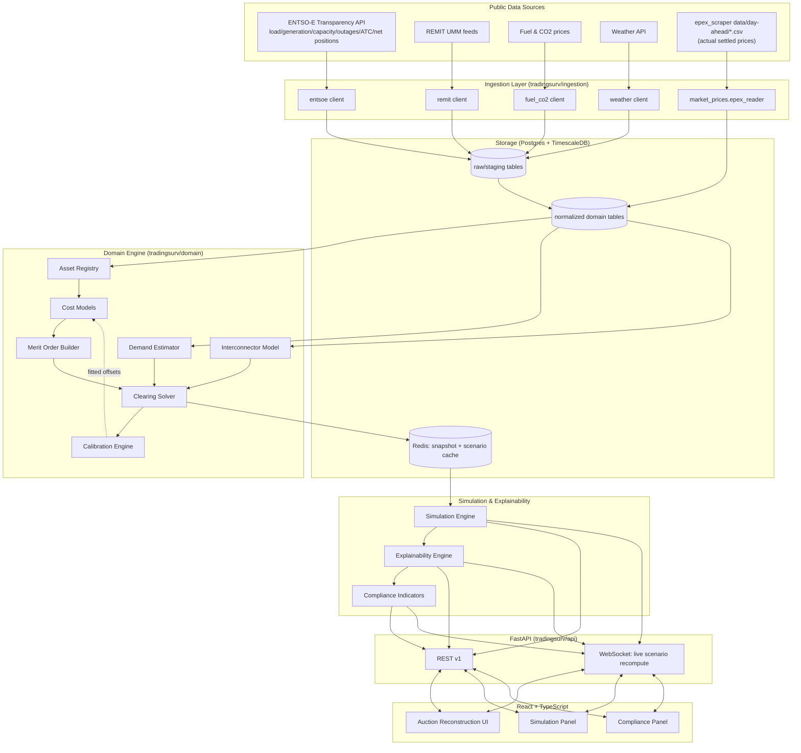

# TradingSurv — Market Reconstruction & Auction Simulator

Design specification for a new module ("MRAS") that reconstructs an estimated
EUPHEMIA day-ahead supply curve from public data and lets compliance users
simulate counterfactual outages/withholding. This is **not** a EUPHEMIA
replica — no participant bids are assumed available.

## 0. Relationship to this repository

`epex_scraper` already solves one hard part of this problem: it is a
running, idempotent archive of **actual settled EPEX prices**
(`data/day-ahead/<zone>/<date>_<resolution>min.csv`). MRAS treats that archive
as its **ground-truth price feed** for calibration (Step 7) and its
**ex-post validation set** — no separate "get actual prices" integration is
needed, just a reader over the existing CSVs. Everything else (generation
assets, outages, load, interconnectors) is new ingestion from ENTSO-E/REMIT.

The scraper's own idioms carry over deliberately: **idempotent,
partition-keyed writes** (`storage.py`'s dedup-by-content pattern) and a
**cron-driven, git-friendly** ingestion loop are reused for ENTSO-E ingestion
and nightly calibration, rather than introducing a new orchestrator (Airflow
etc.) on day one.

Pilot zone recommendation: **AT** or **DE-LU** — both already have deep
day-ahead history in `data/day-ahead/`.

---

## 1. System Architecture



**Component responsibilities**

| Component | Responsibility |
|---|---|
| Ingestion | Pull + normalize public data; idempotent per (zone, timestamp, source) |
| Asset Registry | Canonical list of generation units per zone, sourced from ENTSO-E `Installed Capacity per Unit` + a reference plant DB (JRC-PPDB / Global Power Plant Database) for efficiency/fuel where ENTSO-E is silent |
| Cost Models | Technology-specific marginal cost estimators, calibratable |
| Merit Order Builder | Sorts available capacity by estimated marginal cost into a step supply curve |
| Demand Estimator | Converts ENTSO-E load forecast + weather/calendar into an hourly demand curve (near-vertical, mildly elastic) |
| Interconnector Model | Converts ATC/net positions into virtual import/export supply & demand blocks |
| Clearing Solver | Intersects supply & demand curves |
| Calibration Engine | Nightly walk-forward fit of cost-model offsets against actual EPEX prices |
| Simulation Engine | Pure functional transform of a base auction snapshot under user actions |
| Explainability Engine | Per-action counterfactual price-impact decomposition → template narrative |
| Compliance Indicators | Withholding/scarcity/pivotal-supplier screens — indicators only |

**Materialized snapshot, not live-recompute-from-scratch**: the expensive
part (building the sorted supply curve, resolving asset availability at time
`t`) runs once per (zone, hour) as a batch/near-real-time job and is stored
as `reconstructed_auction` + `supply_curve_point` rows. The Simulation Engine
loads that snapshot into memory and mutates it — it never re-derives the
supply curve from raw ENTSO-E data per request. This is what makes the <1s
(realistically low-ms) simulation budget achievable.

---

## 2. Folder Structure

```
Epex_scraper/
├── epex_scraper/                  # existing scraper — unchanged, becomes a data source
├── tradingsurv/
│   ├── config.py
│   ├── ingestion/
│   │   ├── entsoe/
│   │   │   ├── client.py          # thin auth'd wrapper over ENTSO-E Transparency REST/XML API
│   │   │   ├── load.py            # forecast + actual total load
│   │   │   ├── generation.py      # forecast + actual generation per type/unit
│   │   │   ├── capacity.py        # installed capacity per unit/type
│   │   │   ├── outages.py         # unavailability of generation units (UOU/UOA)
│   │   │   ├── flows.py           # cross-border physical flows
│   │   │   ├── atc.py             # available transfer capacity
│   │   │   └── net_positions.py
│   │   ├── remit/
│   │   │   ├── umm_client.py      # per-TSO/ACER UMM feed polling
│   │   │   └── umm_parser.py      # free-text -> structured outage event
│   │   ├── market_prices/
│   │   │   └── epex_reader.py     # reads existing data/day-ahead/*.csv as ground truth
│   │   ├── fuel_co2/
│   │   │   └── prices.py          # TTF gas, ARA coal, EUA CO2 (public index sources)
│   │   └── weather/
│   │       └── client.py
│   ├── domain/
│   │   ├── assets/
│   │   │   ├── models.py          # GenerationAsset, dataclasses/pydantic
│   │   │   └── registry.py        # build/refresh the per-zone asset registry
│   │   ├── costs/
│   │   │   ├── base.py            # CostModel protocol
│   │   │   ├── thermal.py         # gas/coal/lignite/oil (shared formula, per-fuel params)
│   │   │   ├── nuclear.py
│   │   │   ├── renewables.py      # wind/solar
│   │   │   ├── hydro.py           # opportunity-cost model
│   │   │   ├── battery.py         # opportunity-cost model
│   │   │   └── calibration_offsets.py
│   │   ├── merit_order/
│   │   │   ├── builder.py
│   │   │   └── supply_curve.py    # SupplyCurve value type + SupplyCurveProvider protocol
│   │   ├── demand/
│   │   │   ├── estimator.py
│   │   │   └── curve.py           # DemandCurve value type (near-vertical + elasticity)
│   │   ├── interconnectors/
│   │   │   ├── model.py
│   │   │   └── net_position.py
│   │   ├── clearing/
│   │   │   └── solver.py
│   │   └── calibration/
│   │       ├── engine.py
│   │       ├── metrics.py
│   │       └── adjustments.py
│   ├── simulation/
│   │   ├── snapshot.py            # AuctionSnapshot value type
│   │   ├── actions.py             # ScenarioAction union + apply() functions
│   │   ├── engine.py              # simulate(base, actions) -> ScenarioResult
│   │   └── cache.py
│   ├── explainability/
│   │   ├── driver_analysis.py     # per-action counterfactual price impact
│   │   └── templates.py           # deterministic NLG
│   ├── compliance/
│   │   ├── withholding.py
│   │   ├── scarcity.py
│   │   └── pivotal_supplier.py    # residual supply index (RSI)
│   ├── api/
│   │   ├── main.py
│   │   ├── deps.py
│   │   ├── routers/
│   │   │   ├── zones.py
│   │   │   ├── assets.py
│   │   │   ├── auctions.py
│   │   │   ├── simulations.py
│   │   │   ├── calibration.py
│   │   │   └── compliance.py
│   │   └── schemas/               # pydantic request/response models (separate from ORM)
│   ├── storage/
│   │   ├── db.py                  # SQLAlchemy engine/session
│   │   ├── models.py              # ORM models
│   │   ├── migrations/            # Alembic
│   │   └── cache.py                # Redis client
│   ├── jobs/
│   │   ├── backfill.py
│   │   ├── nightly_reconstruction.py
│   │   ├── nightly_calibration.py
│   │   └── scheduler.py           # reuses the GH Actions cron idiom from scrape.yml
│   └── tests/
├── frontend/
│   ├── src/
│   │   ├── api/                   # typed fetch client generated from OpenAPI
│   │   ├── state/                 # zustand stores: selected auction, active scenario
│   │   ├── types/
│   │   ├── components/
│   │   │   ├── AuctionChart/
│   │   │   │   ├── SupplyCurve.tsx
│   │   │   │   ├── DemandCurve.tsx
│   │   │   │   ├── ClearingPointMarker.tsx
│   │   │   │   ├── StackByTechnology.tsx
│   │   │   │   └── CurveTooltip.tsx
│   │   │   ├── Simulation/
│   │   │   │   ├── ScenarioActionBuilder.tsx
│   │   │   │   ├── ActiveActionsList.tsx
│   │   │   │   ├── ResultsComparison.tsx
│   │   │   │   └── ExplanationCard.tsx
│   │   │   ├── Compliance/
│   │   │   │   ├── WithholdingIndicatorBadge.tsx
│   │   │   │   └── PivotalSupplierPanel.tsx
│   │   │   └── common/
│   │   └── pages/
│   │       ├── AuctionReconstructionPage.tsx
│   │       └── ZoneOverviewPage.tsx
│   └── package.json
└── docs/tradingsurv/ARCHITECTURE.md   # this document
```

---

## 3. Database Schema

Postgres + TimescaleDB (hypertables on all `timestamp`-keyed series — same
data volume profile TimescaleDB is built for: multi-year, hourly/15-min,
multi-zone).

```sql
-- ── Reference ────────────────────────────────────────────────────────────
CREATE TABLE bidding_zone (
    id          SMALLSERIAL PRIMARY KEY,
    code        TEXT UNIQUE NOT NULL,      -- 'DE-LU', 'AT', 'GB', ...
    country     TEXT NOT NULL,
    timezone    TEXT NOT NULL
);

CREATE TABLE generation_asset (
    id                  BIGSERIAL PRIMARY KEY,
    zone_id             SMALLINT REFERENCES bidding_zone(id),
    entsoe_resource_id  TEXT,                       -- ENTSO-E EIC code, nullable (unit-level data is sparse)
    name                TEXT NOT NULL,
    technology          TEXT NOT NULL,               -- gas_ccgt, gas_ocgt, coal, lignite, nuclear, wind_onshore, ...
    fuel                TEXT,
    capacity_mw         NUMERIC NOT NULL,
    efficiency          NUMERIC,                     -- LHV-based, null for zero-marginal-cost tech
    must_run            BOOLEAN NOT NULL DEFAULT FALSE,
    owner               TEXT,                        -- nullable — often unavailable publicly
    commissioning_date  DATE,
    source              TEXT NOT NULL,                -- 'entsoe', 'jrc_ppdb', 'manual'
    updated_at          TIMESTAMPTZ NOT NULL DEFAULT now()
);

-- ── Time series (hypertables) ───────────────────────────────────────────
CREATE TABLE asset_availability (
    asset_id            BIGINT REFERENCES generation_asset(id),
    ts                  TIMESTAMPTZ NOT NULL,
    available_mw        NUMERIC NOT NULL,
    outage_type         TEXT,                        -- 'planned', 'unplanned', NULL = full availability
    source              TEXT NOT NULL,                -- 'entsoe_uou', 'remit_umm'
    umm_id              BIGINT REFERENCES umm_message(id),
    PRIMARY KEY (asset_id, ts)
);
SELECT create_hypertable('asset_availability', 'ts');

CREATE TABLE umm_message (
    id                  BIGSERIAL PRIMARY KEY,
    zone_id             SMALLINT REFERENCES bidding_zone(id),
    asset_id            BIGINT REFERENCES generation_asset(id),
    event_start         TIMESTAMPTZ NOT NULL,
    event_end           TIMESTAMPTZ,
    unavailable_mw      NUMERIC,
    message_type        TEXT,                        -- 'outage', 'transmission', 'other'
    published_at        TIMESTAMPTZ NOT NULL,
    raw_text            TEXT
);

CREATE TABLE load_forecast (
    zone_id BIGINT, ts TIMESTAMPTZ NOT NULL, forecast_mw NUMERIC,
    PRIMARY KEY (zone_id, ts)
);
SELECT create_hypertable('load_forecast', 'ts');
-- analogous hypertables: load_actual, generation_forecast(+technology),
-- generation_actual(+technology), weather_obs, atc(+interconnector_id,+direction),
-- scheduled_exchange, net_position, fuel_price, co2_price

CREATE TABLE actual_price (               -- loaded FROM epex_scraper's CSVs
    zone_id     SMALLINT REFERENCES bidding_zone(id),
    ts          TIMESTAMPTZ NOT NULL,
    resolution  SMALLINT NOT NULL,         -- minutes
    price_eur_mwh NUMERIC,
    source      TEXT NOT NULL DEFAULT 'epex_scraper',
    PRIMARY KEY (zone_id, ts, resolution)
);
SELECT create_hypertable('actual_price', 'ts');

-- ── Reconstruction output ───────────────────────────────────────────────
CREATE TABLE reconstructed_auction (
    id                      BIGSERIAL PRIMARY KEY,
    zone_id                 SMALLINT REFERENCES bidding_zone(id),
    ts                      TIMESTAMPTZ NOT NULL,
    resolution              SMALLINT NOT NULL,
    estimated_clearing_price  NUMERIC,
    estimated_clearing_volume NUMERIC,
    marginal_technology     TEXT,
    marginal_asset_id       BIGINT REFERENCES generation_asset(id),
    actual_price_eur_mwh    NUMERIC,        -- denormalized copy of actual_price at compute time
    price_error             NUMERIC,        -- estimated - actual
    model_version           TEXT NOT NULL,
    calibration_run_id      BIGINT REFERENCES calibration_run(id),
    computed_at             TIMESTAMPTZ NOT NULL DEFAULT now(),
    UNIQUE (zone_id, ts, resolution, model_version)
);

CREATE TABLE supply_curve_point (
    auction_id          BIGINT REFERENCES reconstructed_auction(id),
    rank                INT NOT NULL,
    asset_id            BIGINT REFERENCES generation_asset(id),
    technology          TEXT NOT NULL,
    cumulative_mw       NUMERIC NOT NULL,
    marginal_cost_eur_mwh NUMERIC NOT NULL,
    owner               TEXT,
    country             TEXT,
    PRIMARY KEY (auction_id, rank)
);

-- ── Calibration ──────────────────────────────────────────────────────────
CREATE TABLE calibration_run (
    id              BIGSERIAL PRIMARY KEY,
    model_version   TEXT NOT NULL,
    zone_id         SMALLINT REFERENCES bidding_zone(id),
    period_start    DATE NOT NULL,
    period_end      DATE NOT NULL,
    mae             NUMERIC, rmse NUMERIC, bias NUMERIC,
    params_json     JSONB NOT NULL,
    created_at      TIMESTAMPTZ NOT NULL DEFAULT now()
);

CREATE TABLE cost_model_param (
    id                  BIGSERIAL PRIMARY KEY,
    technology          TEXT NOT NULL,
    zone_id             SMALLINT REFERENCES bidding_zone(id),   -- NULL = global default
    param_name          TEXT NOT NULL,       -- 'offset_eur_mwh', 'scarcity_curve', ...
    value_json          JSONB NOT NULL,
    valid_from          TIMESTAMPTZ NOT NULL,
    calibration_run_id  BIGINT REFERENCES calibration_run(id)
);

-- ── Simulation ───────────────────────────────────────────────────────────
CREATE TABLE scenario (
    id               BIGSERIAL PRIMARY KEY,
    base_auction_id  BIGINT REFERENCES reconstructed_auction(id),
    user_id          BIGINT REFERENCES app_user(id),
    name             TEXT,
    created_at       TIMESTAMPTZ NOT NULL DEFAULT now()
);

CREATE TABLE scenario_action (
    id            BIGSERIAL PRIMARY KEY,
    scenario_id   BIGINT REFERENCES scenario(id),
    order_index   INT NOT NULL,
    action_type   TEXT NOT NULL,    -- remove_generator | reduce_capacity | add_outage |
                                     -- add_umm | increase_demand | reduce_wind |
                                     -- reduce_solar | limit_interconnector
    target_id     BIGINT,           -- asset_id or interconnector_id, nullable
    payload_json  JSONB NOT NULL
);

CREATE TABLE scenario_result (
    scenario_id             BIGINT PRIMARY KEY REFERENCES scenario(id),
    old_price               NUMERIC,
    new_price               NUMERIC,
    price_diff              NUMERIC,
    old_marginal_technology TEXT,
    new_marginal_technology TEXT,
    old_marginal_asset_id   BIGINT REFERENCES generation_asset(id),
    new_marginal_asset_id   BIGINT REFERENCES generation_asset(id),
    explanation_text        TEXT,
    driver_json              JSONB,   -- ranked per-action price-impact decomposition
    computed_at              TIMESTAMPTZ NOT NULL DEFAULT now()
);

-- ── Compliance ───────────────────────────────────────────────────────────
CREATE TABLE compliance_indicator (
    id              BIGSERIAL PRIMARY KEY,
    auction_id      BIGINT REFERENCES reconstructed_auction(id),
    scenario_id     BIGINT REFERENCES scenario(id),   -- nullable; indicator can be baseline or scenario-derived
    indicator_type  TEXT NOT NULL,    -- economic_withholding | capacity_withholding | scarcity_creation | pivotal_supplier
    score           NUMERIC NOT NULL,  -- 0..1
    evidence_json   JSONB NOT NULL,
    disclaimer      TEXT NOT NULL DEFAULT
        'Indicator only — not a conclusion of market abuse. Requires human review under REMIT Art. 3/5.',
    created_at      TIMESTAMPTZ NOT NULL DEFAULT now()
);

CREATE TABLE app_user (id BIGSERIAL PRIMARY KEY, email TEXT UNIQUE NOT NULL, role TEXT NOT NULL);

CREATE TABLE audit_log (
    id          BIGSERIAL PRIMARY KEY,
    user_id     BIGINT REFERENCES app_user(id),
    action      TEXT NOT NULL,
    entity      TEXT NOT NULL,
    entity_id   BIGINT,
    at          TIMESTAMPTZ NOT NULL DEFAULT now()
);
```

Compliance tooling needs a defensible audit trail more than it needs schema
elegance — every `scenario`/`scenario_action`/`compliance_indicator` row is
append-only and timestamped so "what did the analyst simulate and when" is
always reconstructable.

---

## 4. Backend API Design (FastAPI, `/api/v1`)

| Method | Path | Purpose |
|---|---|---|
| GET | `/zones` | List bidding zones with data coverage summary |
| GET | `/zones/{zone}/assets` | Asset registry for a zone (filterable by technology/owner) |
| GET | `/zones/{zone}/auctions?date=&resolution=` | List reconstructed auctions for a day |
| GET | `/auctions/{id}` | Full detail: clearing price/volume, marginal tech/asset, actual price, error |
| GET | `/auctions/{id}/supply-curve` | Ordered `supply_curve_point` rows |
| GET | `/auctions/{id}/demand-curve` | Demand curve parameters/points |
| POST | `/simulations` | `{base_auction_id, actions[]}` → runs engine synchronously, returns `ScenarioResult` (fast path, no job queue needed given the ms-scale budget) |
| GET | `/simulations/{id}` | Fetch a persisted scenario + result |
| PATCH | `/simulations/{id}/actions` | Append/remove one action, recompute incrementally |
| GET | `/simulations/{id}/explanation` | Structured driver breakdown + narrative text |
| GET | `/simulations/{id}/compliance-indicators` | Indicators derived from that scenario |
| GET | `/compliance/indicators?zone=&from=&to=&min_score=` | Baseline (non-simulated) indicator screen across history |
| GET | `/calibration/runs?zone=&from=&to=` | Calibration history/metrics |
| POST | `/calibration/runs` | Trigger recalibration (admin-only, async job + polling) |
| WS | `/ws/simulations/{id}` | Push incremental recompute results as the user edits actions in the builder (avoids one HTTP round-trip per slider tick) |

Notes:
- Pydantic request/response schemas are kept separate from the SQLAlchemy
  ORM models (`api/schemas/` vs `storage/models.py`) so the API contract
  doesn't silently change when storage is refactored.
- Auth: JWT/SSO, RBAC with at least `viewer` / `analyst` / `admin` — only
  `admin` can trigger recalibration; `analyst` can create scenarios;
  everything is logged to `audit_log`.
- `POST /simulations` is deliberately synchronous — the whole point of the
  performance budget (Step 9) is that it doesn't need a job queue.

---

## 5. React Component Architecture

```
AuctionReconstructionPage
├── ZoneDateSelector
├── AuctionChart                         (visx/D3 step-area chart)
│   ├── SupplyCurve                      — cumulative-MW vs marginal-cost step function
│   ├── DemandCurve                      — near-vertical curve, price-elastic tail
│   ├── ClearingPointMarker              — intersection crosshair + price/volume label
│   ├── StackByTechnology                — color-coded bands under the supply step (see dataviz palette)
│   └── CurveTooltip                     — capacity / price / technology / owner / country on hover
├── MeritOrderTable                      — sortable tabular alternative to the chart
├── SimulationPanel
│   ├── ScenarioActionBuilder            — asset picker + action type + magnitude
│   ├── ActiveActionsList                — removable/reorderable chips, drives incremental recompute
│   ├── ResultsComparison                — old vs new price/volume/marginal tech+asset
│   ├── ExplanationCard                  — ranked bullet list + waterfall of driver_json
│   └── ComplianceIndicatorBadge         — score + evidence + persistent "indicator only" disclaimer
└── HistoryTimeline                      — price & calibration error over time, for context
```

State: **React Query** for server-cached reads (zones/assets/auctions —
rarely change once computed), **Zustand** for local scenario-builder state
(the in-progress list of actions before/while they're submitted). Debounce
action edits ~150ms before calling `PATCH /simulations/{id}/actions` — the
backend recompute is fast enough that the UI bottleneck is network
round-trips, not computation, which is exactly what the WebSocket path in
Step 4 is for.

---

## 6. Estimation Algorithms

### 6.1 Marginal cost models

```
Thermal (gas/coal/lignite/oil), technology-shared formula:
    MC[€/MWh_el] = FuelPrice[€/MWh_th] / η
                  + (EmissionFactor[tCO2/MWh_th] / η) * CO2Price[€/tCO2]
                  + VarOM[€/MWh_el]
                  + offset[technology, zone]        # from calibration (Step 7)

Nuclear:
    MC ≈ fixed low constant (fuel + O&M, no CO2), calibrated per zone
    (real nuclear bidding reflects opportunity cost / must-run behavior,
     not fuel cost — do not model it as fuel-driven)

Wind / Solar:
    MC ≈ 0, floor configurable to allow negative bidding under
    negative-price/must-run-subsidy regimes (per-zone flag)

Hydro (opportunity-cost model):
    Run-of-river           → MC ≈ 0, must-run
    Reservoir / pumped storage → MC = water_value(zone, season, reservoir_level)
        water_value estimated as a calibrated quantile of recent day-ahead
        prices, conditioned on time-of-year and (if available) reservoir
        fill level — not a physical hydrology model

Battery (opportunity-cost model):
    MC_discharge = expected_charge_price + degradation_cost
    MC_charge    = -(expected_discharge_price - degradation_cost)
    expected_{charge,discharge}_price = calibrated rolling percentile of the
    zone's realized intraday price spread (reuses epex_scraper's continuous
    and IDA data as the spread signal)
```

### 6.2 Demand estimation

Primary signal is **ENTSO-E's own day-ahead load forecast** — it is already
a strong, published hourly demand estimate; don't re-derive it from scratch.
Layer on:

```
Demand_curve(p) = D0 - ε(zone) * (p - p_ref)
```

where `D0` = ENTSO-E load forecast (bias-corrected by a small residual model
regressing forecast error against temperature/weekday/holiday), and `ε` is a
price-elasticity slope calibrated per zone from the historical
(actual price, actual demand) relationship — this is what gives the demand
curve its slight downward slope instead of being perfectly vertical, needed
for a well-posed intersection with the supply curve, and is what "increase
demand" / DSR-relevant scenarios shift.

### 6.3 Interconnector modeling

Public data supports an **NTC/ATC approximation**, not true flow-based
domain constraints — document this as a known simplification. Imports and
exports are modeled as virtual supply/demand blocks:

```
Import block: capacity = min(ATC[from→zone], scheduled_exchange)
              price     = neighboring zone's own estimated marginal cost
Export block: capacity = min(ATC[zone→to], scheduled_exchange)
              price     = own zone's estimated marginal cost
```

`limit_interconnector` scenarios cap the relevant ATC term directly.

### 6.4 Clearing solver

Supply curve is a monotonically non-decreasing step function of cumulative
MW → marginal cost; demand curve is monotonically non-increasing in price.
Both piecewise-linear/step ⇒ intersection is found by a few iterations of
fixed-point sweep (bisect cumulative capacity against `D(p_candidate)`,
recompute `D` at the resulting price, repeat until stable — converges in
2–3 iterations for realistic curve shapes, sub-millisecond for a few hundred
assets).

---

## 7. Calibration Strategy

Ground truth = `actual_price` (loaded straight from `epex_scraper`'s
existing `data/day-ahead/` archive) — this repository already **is** the
calibration target.

- **Walk-forward, not global fit**: train technology offsets on a trailing
  window, validate on the following window, to avoid look-ahead bias;
  persist every fit as a versioned `calibration_run` + `cost_model_param`
  rows, applied only to auctions computed *after* that calibration's
  timestamp.
- **What gets fit**:
  - Per-technology, per-zone additive `offset_eur_mwh` (robust/Huber
    regression of `price_error` conditioned on which technology was
    estimated-marginal).
  - Hydro/battery water-value & spread percentiles (Step 6.1).
  - **Scarcity premium**: isotonic regression of `price_error` against
    reserve margin ratio `(supply − demand)/demand` — monotonic, captures
    empirical scarcity pricing without hardcoding a value-of-lost-load.
  - **Seasonal adjustment**: residual mean bucketed by month × hour-of-day,
    catching structural gaps (e.g. CHP heat-season must-run) the cost model
    doesn't represent.
- **Metrics**: MAE, RMSE, bias, price-duration-curve KS distance; track
  run-over-run drift and alert if MAE regresses.
- **Guardrails**: cap adjustment magnitude, require minimum bucket sample
  size, never silently apply — calibration diffs are visible in an
  admin/compliance view before they affect live reconstructions.

---

## 8. Simulation Engine

`AuctionSnapshot` is an immutable value object (supply curve, demand curve
params, interconnector state) materialized once per (zone, hour) by the
nightly reconstruction job and cached in Redis.

```python
def simulate(base: AuctionSnapshot, actions: list[ScenarioAction]) -> ScenarioResult:
    snapshot = apply_actions(base, actions)   # pure, O(n) over affected assets
    price, volume, marginal = clear(snapshot) # Step 6.4 solver, sub-ms
    return ScenarioResult(old=clear(base), new=(price, volume, marginal), snapshot=snapshot)
```

- `ScenarioAction` is a discriminated union: `RemoveGenerator`,
  `ReduceCapacity`, `AddOutage`, `AddUMM`, `IncreaseDemand`, `ReduceWind`,
  `ReduceSolar`, `LimitInterconnector`.
- Applying actions never mutates the cached base snapshot — every scenario
  is a fresh derived object, so scenarios compose, undo trivially, and cache
  cleanly on `hash(base_auction_id, actions)`.
- Capacity/demand edits don't change an asset's cost ranking, so the merit
  order doesn't need re-sorting — only the cumulative-MW array — which is
  why the whole call stays comfortably under the 1s budget (realistically
  low-single-digit milliseconds for a few hundred assets), with Redis
  caching for repeated identical scenarios rather than as a load-bearing
  performance requirement.

---

## 9. Explainability Engine

After `simulate()`, decompose the price delta **per action in isolation**:

```
for each action_i in actions:
    price_impact_i = clear(apply(base, [action_i])).price - clear(base).price
```

Each action is its own cheap recompute, so this is still well within budget
even for a handful of stacked actions. Rank by `|price_impact_i|` and feed
the top-N into a **deterministic template** (not an LLM — reproducibility
matters for anything that might end up referenced in a REMIT-relevant
review):

```
Price increased from €{old:.0f}/MWh to €{new:.0f}/MWh.

Primary drivers:
• {capacity} MW {technology} unit removed ({asset_name}).
• {new_marginal_technology} became marginal ({new_marginal_asset}).
• Wind forecast reduced by {wind_delta} GW.
• Imports decreased by {import_delta} MW.
• Demand remained unchanged.
```

Because per-action impacts are computed in isolation, they won't always sum
exactly to the total delta when actions interact (e.g. two removals that
both would have been marginal) — show an explicit **interaction residual**
line rather than silently rounding, so the explanation stays honest. The
structured `driver_json` is the source of truth; narrative text is a
rendering of it, not the other way around.

---

## Compliance Features

Indicators only — the system never concludes market abuse; every indicator
row carries the disclaimer in the schema itself (Step 3) and it's rendered
as a persistent UI banner, not a dismissible tooltip.

- **Economic withholding**: flag when a unit is offline/derated during a
  high scarcity-percentile hour with no corroborating UMM, relative to its
  own historical availability-vs-price pattern.
- **Capacity withholding**: statistical outlier detection on UMM
  frequency/duration/timing per asset/owner vs that asset's own baseline.
- **Scarcity creation**: in simulation, disproportionate price response to a
  small capacity removal (steep local merit-order slope) — flags thin-margin
  hours where concentrated capacity has outsized price leverage.
- **Pivotal supplier / Residual Supply Index** — cheap to compute directly
  from the reconstructed merit order and a natural extension:
  `RSI_owner(h) = (TotalSupply − Owner'sCapacity) / Demand`; `RSI < 1` means
  the system cannot clear without that owner's capacity at hour `h`. Worth
  including from Phase 6 (Step 10) since it reuses data already in the
  supply curve.

---

## 10. Incremental Roadmap — MVP → Production

| Phase | Scope | Est. |
|---|---|---|
| 0 — Foundations | ENTSO-E client (generation/load/capacity/outages) for one pilot zone (AT or DE-LU); `actual_price` loader over existing `data/day-ahead/`; schema v1 (assets, availability, actual_price) | 2–3 wks |
| 1 — Estimation MVP | Cost models for gas/coal/nuclear/wind/solar only (hydro/battery as flat placeholders); merit order builder; demand = ENTSO-E forecast, no elasticity yet; clearing solver; batch script producing `reconstructed_auction` rows; measure baseline MAE vs actual, no calibration yet | 3–4 wks |
| 2 — Calibration v1 | Technology offsets + seasonal adjustment; walk-forward backtest harness; `calibration_run` persistence | 2 wks |
| 3 — API + read-only UI | FastAPI zones/auctions/supply-curve endpoints; React page rendering a static supply/demand/clearing chart for a chosen day | 3 wks |
| 4 — Simulation + explainability | Action model, in-memory recompute, `POST /simulations`, `ScenarioActionBuilder` + `ExplanationCard` | 3–4 wks |
| 5 — Interconnectors + hydro/battery + REMIT UMM | ATC/net-position modeling; hydro/battery opportunity-cost calibration; UMM ingestion auto-mapped into `AddOutage` actions and baseline availability | 4 wks |
| 6 — Compliance layer | Withholding/scarcity indicators, RSI/pivotal-supplier metric, compliance dashboard, audit logging | 3 wks |
| 7 — Scale-out | Multi-zone rollout, multi-year backfill, perf hardening to p99 <1s, calibration-drift monitoring/alerting, `BidSource` adapter interface finalized for future real-bid integration | ongoing |

**Future-proofing for real bid data** (explicit from Phase 1, not bolted on
later): the merit-order builder consumes a `SupplyCurveProvider` protocol.
`EstimatedSupplyCurveProvider` (this whole document) is one implementation;
a future `ActualBidSupplyCurveProvider` backed by commercial exchange bid
data is a drop-in replacement — the clearing solver, simulation engine, and
explainability engine never know which one produced the curve, so none of
them change when real bid data becomes available.

**Key risk to flag early**: ENTSO-E unit-level outage/generation data has
material coverage gaps for smaller plants. Track and surface a per-zone
**data coverage/confidence indicator** in the UI from Phase 1 — silently
treating sparse coverage as "fully available" would bias the merit order and
undermine the compliance use case it's built for.
